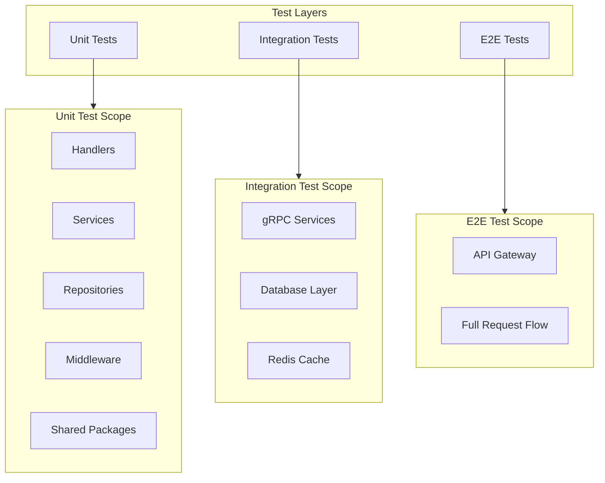

# Test Infrastructure Implementation Plan

## Overview

Implement a multi-layered test strategy covering unit tests (with Mockery-generated mocks), integration tests (gRPC/HTTP), and E2E tests (full system), with GitHub Actions CI/CD pipeline.

## Architecture




## Directory Structure

```javascript
├── mocks/                         # Auto-generated mocks (gitignored)
├── testutil/                      # Shared test utilities
│   ├── fixtures/                  # Test data fixtures
│   ├── helpers.go                 # Common test helpers
│   └── grpc_helpers.go            # gRPC testing utilities
├── apps/
│   ├── order/
│   │   ├── handler/order/order_test.go
│   │   ├── services/order/order_service_test.go
│   │   └── repository/repo_test.go
│   └── auth/
│       ├── handler/auth/auth_test.go
│       └── services/auth/auth_test.go
├── api_gateway/
│   ├── middleware_test.go
│   └── integration_test.go
└── .github/workflows/test.yml     # CI/CD pipeline
```


## Implementation Steps

### 1. Setup Mockery and Generate Interfaces

Install Mockery and create a `mockery.yaml` config at the project root. Extract interfaces from concrete types where needed (e.g., `OrderRepository` interface from the struct).Key files to modify:

- [`apps/order/repository/repo.go`](apps/order/repository/repo.go) - Add `OrderRepositoryInterface`
- [`apps/order/services/order/order_service.go`](apps/order/services/order/order_service.go) - Add `OrderServiceInterface`

### 2. Create Test Utilities Package

Create `testutil/` with shared helpers:

- `helpers.go` - Common assertions, context builders
- `grpc_helpers.go` - gRPC test server setup, mock clients
- `fixtures/` - JSON/Go test data fixtures

### 3. Implement Unit Tests

**Priority targets:**

- [`api_gateway/middleware.go`](api_gateway/middleware.go) - Test each middleware in isolation
- [`apps/order/handler/order/order.go`](apps/order/handler/order/order.go) - Mock service layer
- [`apps/order/services/order/order_service.go`](apps/order/services/order/order_service.go) - Mock repository
- [`pkg/circuitbreaker/`](pkg/circuitbreaker/) - Expand existing tests
- [`pkg/cache/`](pkg/cache/) - Test cache implementations

### 4. Implement Integration Tests

Test real gRPC connections using `bufconn` (in-memory gRPC):

- Order service gRPC endpoint tests
- Auth service gRPC endpoint tests
- API Gateway routing integration

### 5. Implement E2E Tests

Full system tests via API Gateway HTTP endpoints:

- Authentication flow (Login -> Callback -> Protected endpoint)
- Order creation flow
- Rate limiting behavior

### 6. CI/CD Pipeline (GitHub Actions)

```yaml
# .github/workflows/test.yml
name: Tests
on: [push, pull_request]
jobs:
  test:
    runs-on: ubuntu-latest
    steps:
    - uses: actions/checkout@v4
    - uses: actions/setup-go@v5
        with:
          go-version: '1.24'
    - name: Generate mocks
        run: go install github.com/vektra/mockery/v2@latest && mockery
    - name: Run tests
        run: go test -race -coverprofile=coverage.out ./...
    - name: Upload coverage
        uses: codecov/codecov-action@v4
```


### 7. Add Taskfile Commands

Extend [`taskfile.yml`](taskfile.yml) with test tasks:

- `task test:unit` - Run unit tests only
- `task test:integration` - Run integration tests
- `task test:e2e` - Run E2E tests