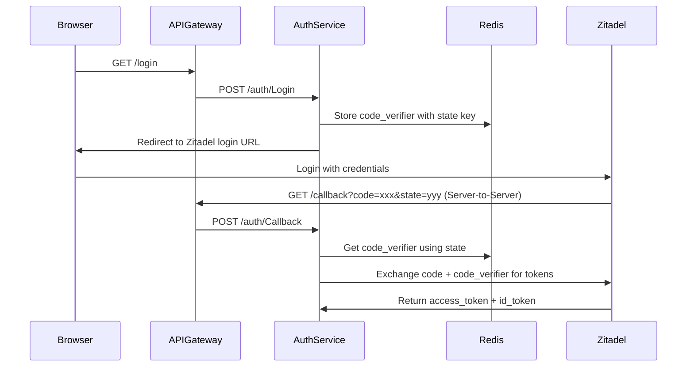

# OAuth2 PKCE Cookie Issue Report

## 📋 Tóm tắt vấn đề

**Vấn đề**: Code verifier trong OAuth2 PKCE flow không được truyền từ login request đến callback request, dẫn đến lỗi "fail to get code verifier from cookie" khi thực hiện token exchange.

**Nguyên nhân chính**: Hiểu nhầm về OAuth2 callback flow - callback từ Authorization Server (Zitadel) là server-to-server call, không phải browser request có cookies.

---

## 🔍 Phân tích chi tiết

### OAuth2 PKCE Flow thực tế



### Vấn đề trong implementation ban đầu

1. **Cookie-based storage**: Code verifier được lưu trong browser cookies
2. **Server-to-server callback**: Zitadel gọi callback endpoint trực tiếp, không có cookies
3. **API Gateway transformation**: GET request được chuyển thành POST, cookies bị mất

---

## 🚨 Root Causes

### 1. Hiểu nhầm về OAuth2 Callback Flow

**❌ Hiểu nhầm**: Callback từ Authorization Server là browser redirect có cookies
```
Browser → Login → Set Cookie → Browser → Zitadel → Browser → Callback (có cookies)
```

**✅ Thực tế**: Callback là server-to-server call không có cookies
```
Browser → Login → Set Cookie → Browser → Zitadel → Server → Callback (KHÔNG có cookies)
```

### 2. Cookie Security Settings

```go
// Vấn đề: Secure flag cố định
http.SetCookie(h.w, &http.Cookie{
    Name:     name,
    Value:    value,
    Path:     path,
    Secure:   true,  // ❌ Luôn true, không hoạt động với HTTP localhost
    HttpOnly: true,
    SameSite: http.SameSiteLaxMode,
})
```

### 3. API Gateway Cookie Forwarding

```go
// Vấn đề: Không forward cookies từ GET sang POST
return &Request{
    Method:  "POST",
    Body:    body,
    Header:  r.Header,  // ❌ Cookies không nằm trong Header
    Subject: subject,
    URL:     urlString,
}
```

---

## 💡 Giải pháp

### Giải pháp 1: Session-based Storage (Recommended)

**Ý tưởng**: Lưu code verifier trong Redis/Session với key là encrypted state

```go
// Store code verifier
codeVerifierKey := fmt.Sprintf("code_verifier:%s", encryptedState)
err = session.Set(ctx, codeVerifierKey, codeVerifier, EXPIRE_IN_SECOND)

// Retrieve code verifier using state from callback
codeVerifierKey := fmt.Sprintf("code_verifier:%s", state)
codeVerifier, err := session.Get(ctx, codeVerifierKey)
```

**Ưu điểm**:
- ✅ Hoạt động với server-to-server callbacks
- ✅ Không phụ thuộc vào cookies
- ✅ Secure và scalable
- ✅ One-time use (có thể delete sau khi dùng)

### Giải pháp 2: Fix Cookie Forwarding (Alternative)

**Cải thiện API Gateway**:
```go
// Copy cookies to headers
if len(r.Cookies()) > 0 {
    var cookieStrings []string
    for _, cookie := range r.Cookies() {
        cookieStrings = append(cookieStrings, fmt.Sprintf("%s=%s", cookie.Name, cookie.Value))
    }
    headers["Cookie"] = []string{strings.Join(cookieStrings, "; ")}
}
```

**Cải thiện Cookie Security**:
```go
// Dynamic Secure flag
isSecure := r.TLS != nil || r.Header.Get("X-Forwarded-Proto") == "https"
cookie := &http.Cookie{
    Secure: isSecure,  // ✅ Chỉ secure khi HTTPS
    // ... other settings
}
```

---

## 🎯 Kiến thức quan trọng

### 1. OAuth2 PKCE Flow

**PKCE (Proof Key for Code Exchange)** là extension của OAuth2 để bảo vệ authorization code:

1. **Code Verifier**: Random string (43-128 chars)
2. **Code Challenge**: SHA256(code_verifier) hoặc plain text
3. **Flow**:
   - Client tạo code_verifier và code_challenge
   - Gửi code_challenge trong authorization request
   - Authorization Server trả về authorization code
   - Client gửi code + code_verifier để đổi lấy token

### 2. OAuth2 Callback Types

**Browser-based Callback** (SPA, Mobile):
```
Authorization Server → Browser → Client App
```
- Có cookies, session storage
- Có thể access DOM, localStorage

**Server-to-Server Callback** (Backend):
```
Authorization Server → Client Server
```
- Không có cookies từ browser
- Chỉ có query parameters và headers
- Cần lưu state trong server storage

### 3. Cookie Security

**Secure Flag**: Cookie chỉ được gửi qua HTTPS
```go
Secure: true   // ❌ Không hoạt động với http://localhost
Secure: false  // ✅ Hoạt động với HTTP (development)
```

**SameSite**: Bảo vệ CSRF
- `Strict`: Chỉ same-site requests
- `Lax`: Same-site + top-level navigation
- `None`: All requests (cần Secure=true)

### 4. API Gateway Patterns

**Request Transformation**:
- GET → POST: Cần preserve cookies
- Headers vs Cookies: Cookies không tự động nằm trong headers
- Context preservation: User info, session data

---

## 🔧 Implementation Details

### Session-based Code Verifier Storage

```go
// AuthCodeUrl - Store code verifier
func (a *Auth[T]) AuthCodeUrl(r *http.Request, w http.ResponseWriter, postLoginSuccessURI string, scopeGetter ScopeGetter, loginOpts []LoginOps) (string, error) {
    // Generate PKCE parameters
    codeVerifier := oauth2.GenerateVerifier()
    codeChallenge := oauth2.S256ChallengeFromVerifier(codeVerifier)
    
    // Create and encrypt state
    state := &authentication.State{RequestedURI: postLoginSuccessURI}
    encryptedState, err := state.Encrypt(decryptKey)
    if err != nil {
        return "", err
    }
    
    // Store code verifier with encrypted state as key
    codeVerifierKey := fmt.Sprintf("code_verifier:%s", encryptedState)
    err = a.Session.Set(a.ctx, codeVerifierKey, codeVerifier, EXPIRE_IN_SECOND)
    if err != nil {
        return "", fmt.Errorf("fail to store code verifier: %w", err)
    }
    
    // Build authorization URL
    authURL := oauth2Config.AuthCodeURL(encryptedState, 
        oauth2.SetAuthURLParam("code_challenge", codeChallenge),
        oauth2.SetAuthURLParam("code_challenge_method", "S256"),
    )
    
    return authURL, nil
}

// getToken - Retrieve code verifier
func (a *Auth[T]) getToken(r *http.Request, cookieHandler CookieHandler, redirectURI, appPath string) (*Token, error) {
    // Get parameters from callback
    queryParams := r.URL.Query()
    code := queryParams.Get("code")
    state := queryParams.Get("state")
    
    // Retrieve code verifier using state
    codeVerifierKey := fmt.Sprintf("code_verifier:%s", state)
    codeVerifier, err := a.Session.Get(a.ctx, codeVerifierKey)
    if err != nil {
        return nil, fmt.Errorf("fail to get code verifier: %w", err)
    }
    
    // Delete after use (one-time use)
    a.Session.Del(a.ctx, codeVerifierKey)
    
    // Exchange code for token
    token, err := oauth2Config.Exchange(r.Context(), code,
        oauth2.SetAuthURLParam("code_verifier", codeVerifier),
    )
    
    return &Token{Token: token, IdToken: token.Extra("id_token").(string), State: state}, nil
}
```

### Cookie Forwarding in API Gateway

```go
func convertHttpGetRequestToNatsPostRequest(r http.Request) (*Request, error) {
    // Copy headers
    headers := make(map[string][]string)
    for key, values := range r.Header {
        headers[key] = values
    }
    
    // Add cookies to headers
    if len(r.Cookies()) > 0 {
        var cookieStrings []string
        for _, cookie := range r.Cookies() {
            cookieStrings = append(cookieStrings, fmt.Sprintf("%s=%s", cookie.Name, cookie.Value))
        }
        headers["Cookie"] = []string{strings.Join(cookieStrings, "; ")}
    }
    
    return &Request{
        Method:  "POST",
        Header:  headers,  // Now includes cookies
        Body:    body,
        Subject: subject,
        URL:     urlString,
    }, nil
}
```

---

## 🧪 Testing & Debugging

### Debug Logs để kiểm tra

```go
// Login phase
fmt.Printf("AuthCodeUrl - Stored code verifier with key: %s\n", codeVerifierKey)
fmt.Printf("AuthCodeUrl - Code verifier: %s\n", codeVerifier)

// Callback phase  
fmt.Printf("getToken - Retrieved code verifier: %s\n", codeVerifier)
fmt.Printf("getToken - State parameter: %s\n", state)

// Cookie debugging
fmt.Printf("Original request cookies: %d\n", len(r.Cookies()))
for _, cookie := range r.Cookies() {
    fmt.Printf("  Cookie: %s = %s\n", cookie.Name, cookie.Value)
}
```

### Test Cases

1. **Happy Path**: Login → Redirect → Callback → Token Exchange
2. **State Mismatch**: Invalid state parameter
3. **Expired Code Verifier**: Code verifier đã expire
4. **Missing Code Verifier**: Code verifier không tồn tại
5. **HTTP vs HTTPS**: Cookie security settings

---

## 📚 Best Practices

### 1. OAuth2 Security

- ✅ Luôn sử dụng PKCE cho public clients
- ✅ Validate state parameter để chống CSRF
- ✅ Code verifier phải random và unique
- ✅ Expire code verifier sau khi sử dụng
- ✅ Validate redirect_uri

### 2. Session Management

- ✅ Sử dụng Redis/Database cho distributed systems
- ✅ Set appropriate expiration times
- ✅ Clean up expired sessions
- ✅ Encrypt sensitive data

### 3. Cookie Security

- ✅ Dynamic Secure flag (HTTPS in production, HTTP in development)
- ✅ HttpOnly để chống XSS
- ✅ SameSite để chống CSRF
- ✅ Appropriate Path và Domain settings

### 4. API Gateway Design

- ✅ Preserve context khi transform requests
- ✅ Forward cookies properly
- ✅ Handle different content types
- ✅ Implement proper error handling

---

## 🔄 Migration Strategy

### Phase 1: Implement Session Storage
1. Add session-based code verifier storage
2. Keep cookie-based as fallback
3. Add comprehensive logging

### Phase 2: Test & Validate
1. Test với different environments (HTTP/HTTPS)
2. Validate security properties
3. Performance testing

### Phase 3: Cleanup
1. Remove cookie-based fallback
2. Clean up debug logs
3. Update documentation

---

## 📖 References

- [RFC 7636 - PKCE](https://tools.ietf.org/html/rfc7636)
- [OAuth 2.0 Security Best Practices](https://tools.ietf.org/html/draft-ietf-oauth-security-topics)
- [HTTP Cookies - MDN](https://developer.mozilla.org/en-US/docs/Web/HTTP/Cookies)
- [Go OAuth2 Package](https://pkg.go.dev/golang.org/x/oauth2)

---

## 👥 Contributors

- **Nguyễn Hữu Khải** - Problem identification and solution design
- **Claude AI Assistant** - Technical analysis and implementation guidance

---

*Report generated on: October 30, 2025*
